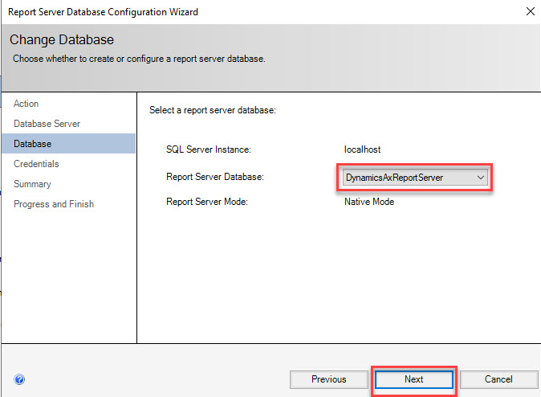
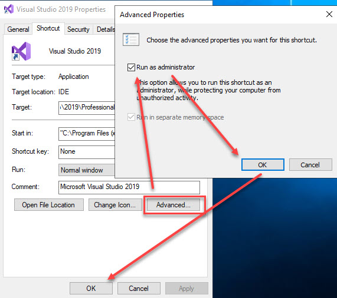
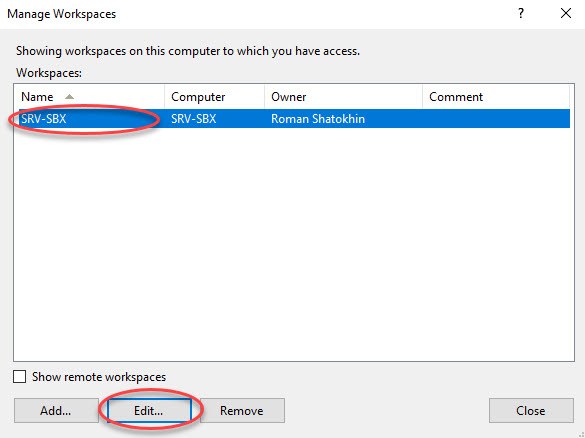

Deploying a local development environment is kind of routine task for an F&O developer.
Below are the steps I always follow to get my environment up and ready to work.

## Download VHD.

Usualy I download VHD files from LCS shared asset library - [Shared asset library](https://lcs.dynamics.com/V2/SharedAssetLibrary).

There is "Downloadable VHD" tab from where I can download VM image.


You can use your browser download manager or a third-party one.

I prefer to use PS script and ``azcopy``.

Docs -> [azcopy](https://docs.microsoft.com/en-us/azure/storage/common/storage-ref-azcopy)

Original -> [How to: fast download of software deployable packages from LCS](https://sites.google.com/site/dynamicsaxblog/how-to-devops-all-the-posts-at-once/howtofastdownloadofsoftwaredeployablepackagesfromlcs)

In my case, the PS script looks like this:

```powershell
cd C:\temp\
.\azcopy\azcopy.exe copy "<SAS URL>" "E:\VIRTUAL MACHINES\D365\10.0.24\FinandOps10.0.24.part01.rar"
.\azcopy\azcopy.exe copy "<SAS URL>" "E:\VIRTUAL MACHINES\D365\10.0.24\FinandOps10.0.24.part02.rar"
.\azcopy\azcopy.exe copy "<SAS URL>" "E:\VIRTUAL MACHINES\D365\10.0.24\FinandOps10.0.24.part03.rar"
.\azcopy\azcopy.exe copy "<SAS URL>" "E:\VIRTUAL MACHINES\D365\10.0.24\FinandOps10.0.24.part04.rar"
.\azcopy\azcopy.exe copy "<SAS URL>" "E:\VIRTUAL MACHINES\D365\10.0.24\FinandOps10.0.24.part05.rar"
.\azcopy\azcopy.exe copy "<SAS URL>" "E:\VIRTUAL MACHINES\D365\10.0.24\FinandOps10.0.24.part06.rar"
.\azcopy\azcopy.exe copy "<SAS URL>" "E:\VIRTUAL MACHINES\D365\10.0.24\FinandOps10.0.24.part07.rar"
.\azcopy\azcopy.exe copy "<SAS URL>" "E:\VIRTUAL MACHINES\D365\10.0.24\FinandOps10.0.24.part08.rar"
.\azcopy\azcopy.exe copy "<SAS URL>" "E:\VIRTUAL MACHINES\D365\10.0.24\FinandOps10.0.24.part09.rar"
```

Once download completed you may want to extract archive files into target folder. The target folder is the folder of your further VM.

As a result of this step we should have a single extracted VHD file.

>Note:
>
>If you already have a VM with the same VHD disk you may want to change unique id of the image (it's addressed to Oracle VirtualBox).
>
>Below is the PS script:
>
>``` powershell
>#### Sets execution policy to allow Windows 10 to execute the PS scripts. Run this command if neccecery
>#### set-executionpolicy remotesigned
>########## VARIABLES ##########
>$VBoxManager = "C:\Program Files\Oracle\VirtualBox\VBoxManage.exe"
>$VirtualDiskAbsolutePath = "D:\SANDBOX\FinandOps10.0.24_sandbox.vhd"
>$VBArgs = @('internalcommands', 'sethduuid', $VirtualDiskAbsolutePath)
>#### COMMAND to change a disk's UUID ####
>& $VBoxManager $VBArgs
>```

## Create VM with custom settings

I usually use Oracle VirtualBox so the steps describe VM native settings for VirtualBox.

### Oracle VirtualBox

1. Create a new VM.


2. Give it a desired name, pick the VHD up, and set up memory and OS type as shown in the picture.


3. General settings.


4. System settings.


5. Storage settings.

If you use SSD (I hope you do) the check-box is extremely important from a performance perspective.


6. Network settings.


7. Shared folder.

Map desired shared folder to ensure file-moving between host and VM.


## Install VirtualBox Guest Addition.

Insert virtual CD image and follow steps below.


## Run Basic scripts for Windows 2016 Server.

The script below helps to quickly make some OS settings and rename VM (required step if you are going to connect to Azure DevOps).

Author -> [Valery Moskalenko](https://vmoskalenkoblog.wordpress.com/)

>Note: Computer name is set in line #43.

``` powershell
# Resolve error in browser - ERR_HTTP2_INADEQUATE_TRANSPORT_SECURITY
function MakeRegistryChanges
{
    $registryPath = "HKLM:\SYSTEM\CurrentControlSet\Services\HTTP\Parameters"
    $EnableHttp2TlsProp = "EnableHttp2Tls"
    $EnableHttp2CleartextProp = "EnableHttp2Cleartext"
    $PropValue = "0"

    if(!(Test-Path $registryPath))
    {
        Write-Host "Specified Registry path $registryPath does not exist. MakeRegistryChanges function did not resolve ERR_HTTP2_INADEQUATE_TRANSPORT_SECURITY error. Please check it in manual way." -ForegroundColor Red
    }
    else
    {
        New-ItemProperty -Path $registryPath -Name $EnableHttp2TlsProp -Value $PropValue -PropertyType DWORD -Force | Out-Null
        New-ItemProperty -Path $registryPath -Name $EnableHttp2CleartextProp -Value $PropValue -PropertyType DWORD -Force | Out-Null
    }
}
#Disable IE Enhanced Security Configuration
function Disable-IEESC
{
$AdminKey = “HKLM:\SOFTWARE\Microsoft\Active Setup\Installed Components\{A509B1A7-37EF-4b3f-8CFC-4F3A74704073}”
$UserKey = “HKLM:\SOFTWARE\Microsoft\Active Setup\Installed Components\{A509B1A8-37EF-4b3f-8CFC-4F3A74704073}”
Set-ItemProperty -Path $AdminKey -Name “IsInstalled” -Value 0
Set-ItemProperty -Path $UserKey -Name “IsInstalled” -Value 0
Stop-Process -Name Explorer
Write-Host “IE Enhanced Security Configuration (ESC) has been disabled.” -ForegroundColor Green
}
Disable-IEESC
#Disable UAC
Write-Verbose( "Disable UAC") -Verbose 
# More details here https://www.powershellgallery.com/packages/cEPRSDisableUAC
& "$env:SystemRoot\System32\reg.exe" ADD "HKLM\SOFTWARE\Microsoft\Windows\CurrentVersion\Policies\System" /v ConsentPromptBehaviorAdmin /t REG_DWORD /d 4 /f
& "$env:SystemRoot\System32\reg.exe" ADD "HKLM\SOFTWARE\Microsoft\Windows\CurrentVersion\Policies\System" /v EnableInstallerDetection /t REG_DWORD /d 1 /f
& "$env:SystemRoot\System32\reg.exe" ADD "HKLM\SOFTWARE\Microsoft\Windows\CurrentVersion\Policies\System" /v EnableLUA /t REG_DWORD /d 0 /f 
gpupdate
#password age pop up
net accounts /maxpwage:unlimited
# update regitry keys
Write-Verbose( "Update Registry keys") -Verbose 
MakeRegistryChanges
#Rename and restart
$NewComputerName = 'SRV-SBX'
$NewComputerNamelength = $NewComputerName.Length
if($NewComputerNamelength -ge 15)
{
Write-Host "Computer name should be less than 15 symbols. Current length is $NewComputerNamelength symbols. Please update computer name. And repeat last step" -ForegroundColor Red
}
else
{
Rename-Computer -NewName $NewComputerName
Restart-Computer
}
```

VM should go to reboot.

## Update SSRS to use local server name.

Starting recent updates the VHD images are delivered with the correct SSRS configuration which does not need to be updated.

You can check the configuration here.


Connect to localhost instance.


SQL Server name should be 'localhost'. 


If the server name is different then most likely it has original VM's name (as you remember we have changed VM's name).

So I would recommend taking the steps below to align SSRS configuration.





Report portal deployment is an optional step.


That is it for SSRS configuration in our local environment.

## Set up links (optional).

For better experience I prefer to pin the most used apps to taskbar.


Do not forget the applications which are used for development must run as Administrator.



## Run the following SQL script (optional).

With the script below we can do fine-tunning SQL server performance.

Using MS SQL Server Management Studio, run the script.

```tsql
/* Performance options */ 
EXEC sys.sp_configure N'show advanced options', N'1' RECONFIGURE WITH OVERRIDE
EXEC sys.sp_configure N'min server memory (MB)', N'2048'
EXEC sys.sp_configure N'max server memory (MB)', N'8192'
EXEC sys.sp_configure N'backup compression default', N'1'
EXEC sys.sp_configure N'cost threshold for parallelism', N'50'
EXEC sys.sp_configure N'max degree of parallelism', N'1'
RECONFIGURE WITH OVERRIDE
GO
EXEC sys.sp_configure N'show advanced options', N'0' RECONFIGURE WITH OVERRIDE
GO

```

## Create AxDB backup (with demo data).

Make a backup of original AxDB database (just in case).

Using MS SQL Server Management Studio, run the script.

```tsql
BACKUP DATABASE [AxDB] TO DISK = N'C:\EmptyDataset\AxDB_Std.bak' 
WITH COPY_ONLY, NOFORMAT, INIT, NAME = N'AxDB-Full Database Backup', 
SKIP, NOREWIND, NOUNLOAD, COMPRESSION, STATS = 5
GO

```

This step will give us ability to restore original database quickly (in case of any unexpected troubles).

## Connect to TFS and configure local workspace.

Obviously, we deploy local environment either for personal needs or for a specific project.

In the second case we need to connect to a team project.

Below you can find the sep to configure local TFS workspace (I have not used Git yet).

Using Team Explorer we connect to a specific project in Azure DevOps.


In Team Explorer window click 'connect' icon.


On Connect page, under Manage connection drop-down, hit "Connect to a Project" option.


Enter your credentials and select desired project to connect.


Go back to Team Explorer window and set workspace up (sometimes Visual Studio needs to be re-started after connecting to a project).


Select a workspace and hit "Edit" button.



Map server folder to local paths (usually a DevOps guy shares the details with you).


Now we can go ahead and refresh our local worspace codebase from server.

Open Source control explorer page and get the latest code.


Now we should have everything in place.

## Refresh and build required models.

Last actions to take - 1) refresh models. 2) Build/Sync operations.


Note: if Build operation is finished with errors then Sync operation will not make any sense. You should first do a successful build.

## Install additional software (optional)

As of now I often use the following applications which need to be installed.

- Microsoft Edge as a primary browser.

- Visual Studio Code.

- Postman (optional).

- Storage account explorer (optional).

- Git Windows desktop client (optional).

## Administrating provision.

Now we would want to get into the local D365 application. 

We have to set up our account as an administrator.

Note: Sometimes, we use client's database, in that case your account may have been already added and you can skip this step.

Run the tool as an Administrator account, give there your account.

The tool can be found either on Desktop or by the following path - {Your drive}:\AOSService\PackagesLocalDirectory\Bin\

(One time, I remember, there was no the tool in my VM, at all, nowhere, I had to copy-paste the app from another VM)


>UPD: Since 10.0.24 VHD, we have to take some extra steps.
>
>See this blog post - [Admin Provisioning Tool Error: The value’s length for key ‘password’ exceeds its limit of ‘128’](https://erpcoder.blog/2022/04/12/admin-provisioning-tool-error-the-values-length-for-key-password-exceeds-its-limit-of-128/)

## Personalize application.

Usually I change color schema and scale of user interface. 

In this way I can differentiate D365 instances.

For example:

1. Orange - My dev environment.

2. Green - UAT environment.

3. Blue - Production.

4. Brown - Performance test

---

That's it. Happy codding! :)